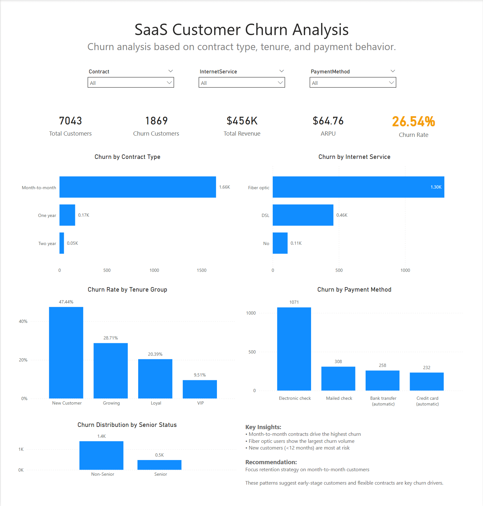

# SaaS Customer Churn Analysis Dashboard

## Project Overview
This project analyzes customer churn behavior in a SaaS business using Power BI.  
The objective is to identify key drivers of churn and provide actionable business recommendations to improve customer retention.

---

## Business Questions
- Which contract type has the highest churn?
- How does customer tenure impact churn rate?
- Which payment methods are associated with higher churn?
- What customer segments are most at risk?

---

## Dashboard Preview


---

## Key Insights
- Month-to-month contracts show the highest churn compared to long-term contracts.
- Fiber optic customers contribute the largest portion of churned users.
- New customers (low tenure) have significantly higher churn rates.
- Customers using electronic check exhibit higher churn than other payment methods.

---

## Recommendations
- Prioritize retention strategies for customers with month-to-month contracts.
- Improve onboarding experience to reduce early-stage churn.
- Encourage migration to longer-term contracts through incentives.
- Investigate potential issues in electronic payment processes.

---

## Tools and Technologies
- Power BI
- DAX (Data Analysis Expressions)
- Data Modeling

---

## Dataset
This project uses a public/sample SaaS churn dataset.

---

## Project Structure
```
saas-churn-analysis/
│
├── dataset/
│   └── telco-churn-dataset.csv
│
├── dashboard/
│   ├── dashboard-preview.png
│   └── saas-churn-dashboard.pdf
│
├── report/
│   └── saas-churn-powerbi-dashboard.pbix
│
└── README.md
```

---

## Author
Ahmad Iqbal Maulana - Data Analyst
